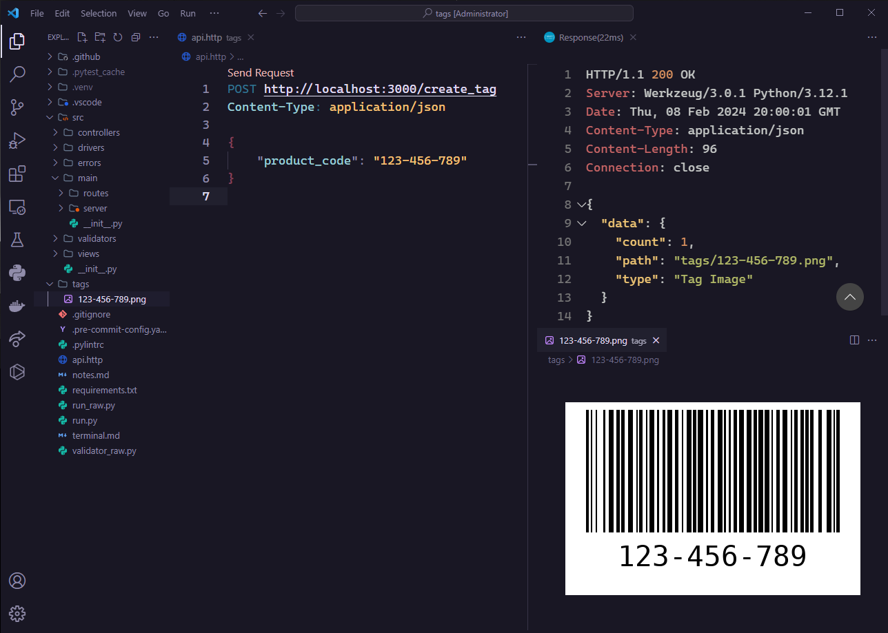
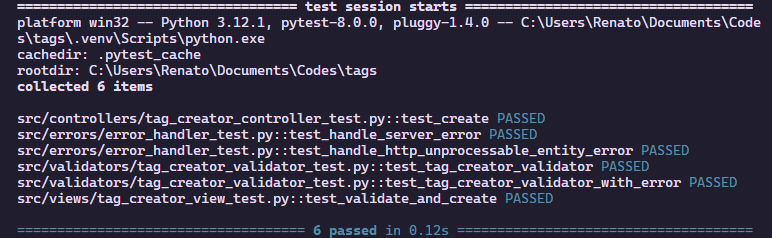

<h1 align="center">
  <div>
    <p>NLW Tags</p>
  </div>
  <div>
    
    
  </div>
</h1>

## ✨ Description

This python API creates tags/barcodes for your products.

Developed with 💜 during the Next Level Week - Python by Rocketseat.

## 🚀 Technologies
-  Python (programming language)
-  Flask (web framework for Python)
-  Cerberus (data validation)
-  Python Barcode (barcode generation)
-  Pre-commit (code validation)
-  Pylint (code linting)
-  Pytest (unit tests)
-  Virtual Env (virtual enviroment with all the project's dependencies)

## 💻 Installation

> Make sure you have Python installed on your machine.

1. Clone this repository <br />
```bash
git clone https://github.com/renatomarquesteles/nlw-expert-python.git
```
2. Install virtual environment <br />
```bash
pip3 install virtualenv
```
3. Create the virtualenv
```bash
py -m venv .venv
```
4. Run the script <br />
```bash
python run.py
```
5. Send a HTTP POST request to the route "/tags" with a "product_code" of type string in the body

## 🌟 Preview

<div>
  
  
</div>
